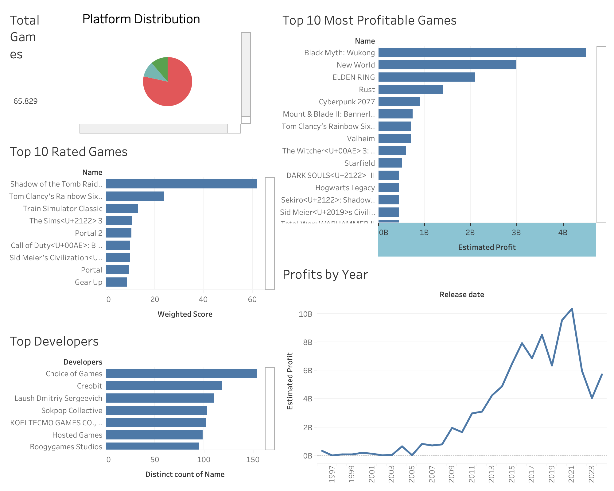

# Analyzing Steam Games Market Trends: Insights Using R, SQL, and Tableau

## Project Overview

This project analyzes the **Steam Games Market Trends** using a dataset of over 65,000 games published on Steam. The primary objective is to uncover insights such as top-rated games, most profitable games, platform distribution, and profit trends over time. 

The project integrates **data cleaning with Python (in Jupyter Notebook)**, **analysis using SQL**, and **visualization with Tableau** to provide a detailed, interactive dashboard.

---

## Objectives

1. **Explore Steam Games Trends**:
   - Identify the top-rated games based on reviews.
   - Find the most profitable games by combining price and estimated owners.
   - Understand platform distribution across Windows, Mac, and Linux.
   - Analyze profitability trends by release year.

2. **Build a Tableau Dashboard**:
   - Combine visualizations for actionable insights.

---

## Tools and Technologies

### **Python (Jupyter Notebook)**
- Used for **data cleaning** in the `Data Cleaning.ipynb` notebook.
- Key preprocessing steps:
  - Extracted and split ranges in `Estimated Owners` into `Min Owners` and `Max Owners`.
  - Calculated derived metrics such as:
    - `Average Owners`: `(Min Owners + Max Owners) / 2`
    - `Total Reviews`: `Positive + Negative`
    - `Rating Percentage`: `(Positive / Total Reviews) * 100`
    - `Estimated Profit`: `Price * Average Owners`.

### **SQL**
- Analyzed the cleaned dataset using SQL queries in `Data_Exploration.sql`.
- Key SQL insights:
  - Top-rated games based on `Rating Percentage`.
  - Most profitable games using `Estimated Profit`.
  - Yearly trends in profitability.
  - Distribution of games by platform.

### **Tableau**
- Designed a fully interactive dashboard in `Tableau Dashboard.twb`.
- Visualized:
  - **Platform Distribution**: Pie chart.
  - **Top 10 Most Profitable Games**: Bar chart.
  - **Top 10 Rated Games**: Bar chart.
  - **Top Developers**: Bar chart.
  - **Profits by Year**: Line chart.

---

## How to Run the Project

### **Step 1: Download the Dataset**
The dataset used in this project can be downloaded from [Kaggle - Steam Games Dataset](https://www.kaggle.com/datasets/fronkongames/steam-games-dataset).

1. Download the dataset from the link above.
2. Place the downloaded file (`games.csv`) into the `data/` directory.

---

### **Step 2: Data Cleaning**
1. Open the `Data Cleaning.ipynb` notebook in Jupyter Notebook.
2. Run the code to clean and preprocess the `games.csv` dataset.
3. Save the cleaned dataset as `steam_games_cleaned.csv` in the `data/` directory.

---

### **Step 3: SQL Analysis**
1. Import `steam_games_cleaned.csv` into your SQL database.
2. Run the queries from `Data_Exploration.sql` to generate insights.

---

### **Step 4: Tableau Dashboard**
1. Open `Tableau Dashboard.twb` in Tableau.
2. Connect to `steam_games_cleaned.csv` or the SQL database.
3. Explore and customize the dashboard.

---

## Dashboard Preview

---

## Conclusion

This project demonstrates a comprehensive analysis of Steam's game market trends by integrating data cleaning, SQL analysis, and Tableau visualizations. The dashboard provides actionable insights for game developers, publishers, and marketers.
